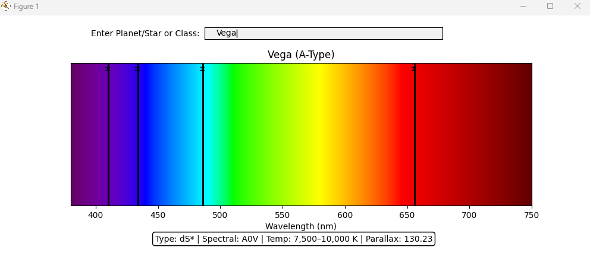

# Spectra Explorer

Interactive Stellar Spectrum Visualizer in Python

Spectra Explorer is a Python tool that simulates and visualizes astronomical spectra. Users can search for stars, stellar classes, or known astronomical objects and view their absorption spectral lines plotted across the visible spectrum.

The program integrates astronomical data from the SIMBAD Astronomical Database using the Astroquery library and displays spectral lines using Matplotlib.

This project was created as a way to explore astronomy, physics, and interactive data visualization using Python.

---
Features
---

**Astronomical Object Search**

Search for stars or planets by name and retrieve metadata from **SIMBAD**:  
Object type  
Spectral classification  
Parallax

---
**Example searches:**  
Sirius  
Betelgeuse  
Sun  
Mars

---
**Interactive Spectrum Visualization**

The program plots a visible spectrum (380–750 nm) and overlays known element absorption lines.

**Supported elements include:**  
But not limited to:  
Hydrogen  
Helium  
Oxygen  
Carbon  
Iron  
Calcium  
Magnesium  
Sodium  

---
**Stellar Classification Simulation**

Users can enter a stellar class directly to simulate expected spectral lines:  

**O B A F G K M**  

EX: **G** -> Displays a G-type star spectrum similar to the Sun.  

---
**Scientific Visualization**  
The spectrum background is generated by converting wavelength values to RGB colors,
producing a realistic visible light spectrum.
---

Black vertical lines represent absorption wavelengths of elements in the star’s atmosphere.

---
## Installation

git clone https://github.com/BusterShrugz/spectra-explorer.git
cd spectra-explorer

---
## Dependencies
**pip install matplotlib numpy astroquery**  
Required libraries:  
NumPy  
Matplotlib  
Astroquery

---
## Project Structure
spectra-explorer/  
│  
├── spectra.py  
├── README.md  
└── requirements.txt  

**Main components:**  
spectral_data      → wavelength database  
astro_objects      → known object compositions  
stellar_classes    → stellar spectral models  
plot_absorption()  → spectrum rendering  
search_object()    → SIMBAD API queries  

---
## Future Improvements  
**Planned enhancements include:**  
Doppler shift simulation  
Emission spectra mode  
Expanded spectral line database  
Real stellar spectra from astronomical surveys  
Interactive periodic table of elements  
Radial velocity visualization for exoplanet detection  
Web-based visualization  

---
## Author

Reese Edens  
Computer Science / Software Engineering  
Interested in:  
Scientific computing  
Data visualization  
Game development  
Astronomy and physics simulations  